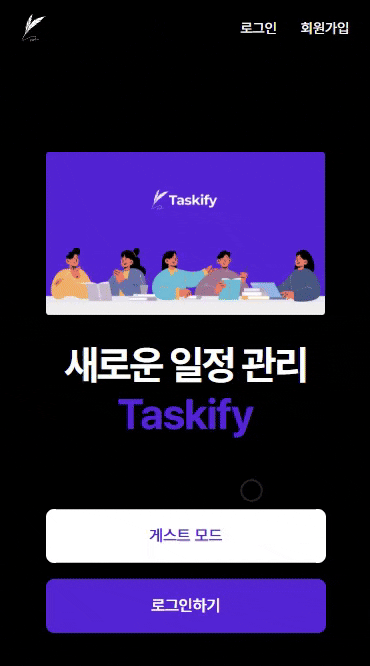

<h1 align="center">Taskify</h1>
<p align="center">협업과 일정 관리를 한 번에! 직관적인 대시보드 서비스</p>

<div style="text-align: center;">
  <a href="https://taskify-theta-plum.vercel.app/">
    
  </a>
</div>
<p style="text-align: center;">
- 개발 기간 : 25.03.18 ~ 25.04.04<br>
- 리팩토링 : 25.04.08 ~ 25.04.15
</p>

# 🗓️ Taskify는?

카드를 등록해 일정을 관리할 수 있는 그룹 대시보드입니다.<br>
멤버를 초대해 일정을 공유하고 협업을 관리해 보세요!<br>
정식 프로젝트 기간 종료 후 리팩토링을 진행하며 직접 이용했어요.

# 🤝 Team

### 황혜진

**팀장**

1. **공통 컴포넌트**

- `Button`, `Modal`을 크기 및 버튼 개수 설정 등 유동적인 UI로 구성
- `Card`, `CardList`, `Column` 작성
- `CardList`, `Column`의 스크롤 바닥 감지를 통한 무한 스크롤 기능 구현
- 카드 생성 / 삭제 / 상세조회 기능을 포함한 모달 기반 UI 작성 (`AddColumnModal`, `ColumnDeleteModal`, `ColumnManageModal`)

2. **페이지**

- `[dashboardId]index`에서 칼럼 및 카드 데이터 동적 렌더링

3. **기타 기여 사항**

- 프로젝트 초기 컨벤션(파일명, 커밋 메시지, 브랜치 네이밍 등) 설정 및 팀 내 공유

### 임용균

1. **공통 컴포넌트**

- `Input`, `SideMenu`, `TodoModal`, `TaskModal`
- `SideMenu` 접기/펴기 기능 및 반응형
- `TodoModal`, `TaskModal` Api 연동 및 업로드 기능 구현

2. **페이지**

- `landing`, `MyDashboard`
- MyDashboard Page 검색어 기반 필터링 및 페이지네이션 연동
- `MydashBoardPage` D&D 적용
- `dexie` 를 활용하여 DB를 생성하여 D&D로 대시보드의 순서변경을 저장

3. **로직 분리 및 성능 개선**

- `useDashboardDragHandler` 커스텀 훅으로 `handleDragEnd` 로직 분리
- `MydashBoardPage` 검색 필터링 useMemo최적화, 대시보드 리스트 필터링 useMemo 적용
- `CardDetailModal` 상태 분리 및 로직분리, `useCardDetailState`, `useCardDetail` 상태분리 및 로직분리
- `SideMenu` 페이지네이션`usePagination` 로직분리 및 `DashboardItem`로 사이드 메뉴 아이탬 관리

4. **리팩토링**

- `SideMenu`, `landingPage` 등 CSS 리팩토링
- `TaskModal` 담당자 선택에 프로필 이미지 적용
- `Modalinput` DatePicker 리팩토링 및 한국어화 커스터마이징. 및 모바일 뷰 최적화

5. **기타 기여 사항**

- 프로젝트 세팅
- 프로젝트 전반 QA 및 리팩토링

### 조민지

1.  **전역 스타일링**

- `globals.css`, `custom toast`, 전체 페이지 및 컴포넌트 전반 CSS

2. **공통 컴포넌트**

- Gnb (`HeaderDefalt`, `HeaderDashboard`) 구현
- 모달, 태그 등 재사용 컴포넌트 공통화
- `MemberListMenu` 드롭다운 메뉴 추가(타인의 대시보드 멤버 목록 확인 가능)

3. **페이지**

- 로그인 / 회원가입 / 404페이지 UI 및 기능 구현

4. **전역 상태 관리 & 예외 처리**

- Zustand, `useAuthGuard`를 활용한 전역 인증 상태 관리 및 비로그인 접근 제한
- `postAuthGuard`로 중복 POST 요청 방지
- 전역 `LoadingSpinner` 적용으로 페이지 이동 중 사용자 경험 개선
- 카드, 대시보드, 멤버 등 생성/수정/삭제 시 새로고침 없이 상태가 즉시 반영되도록 구조 리팩토링

5. **UI/UX 리팩토링**

- 전역 UI 통일: 버튼 순서(`취소` 왼쪽 / `확인` 오른쪽), `cursor`, `disabled`, 경고 메시지 style
- `SideMenu`, `Header`, `Card` 등에서 제목 생략 처리 및 리스트 overflow 대응
- 이미지 팝업 모달 구현(클릭 시 원본 확인 가능)
- 모바일 대응: `window.innerHeight` 기반 높이 계산 적용 → 스크롤 버그 해결
- 모바일 대응: input text size 16px 이상으로 조정 → IOS 확대 방지

6. **에러 핸들링 및 사용자 경험 개선**

- 글자수 제한, 이미지 용량 제한, 중복 이메일 가입 등 에러 toast 처리
- 대시보드 삭제 재확인 모달 및 댓글/카드 삭제 시 확인 모달 추가
- 대시보드 수정/삭제 접근성 개선을 위해 `mydashboard`에 대시보드 편집 모드 추가
- 사용자 구분을 위해 `RandomProfile` 유저 별 색상 고정
- 게스트 모드 초기 진입 시, 초대 내역 로딩 전 `EmptyInvitations` 컴포넌트가 깜빡이는 렌더링 버그 해결<br>
  → `setTimeout`을 활용한 상태 업데이트 defer 처리

7. **기타 기여 사항**

- 게스트 모드 구현
- 프로젝트 전반 QA 수행: 정렬 오류, 반응형 깨짐, 유효성 처리 미흡 등 직접 디버깅 혹은 팀원 수정 요청
- **Taskify를 실사용**하며 리팩토링 작업 진행, 자체 보드를 통해 일정 관리<br>
  → 사용성 기반 QA를 병행하여 실사용자 관점에서의 불편함을 개선

### 김교연

1. **공통 컴포넌트**

- Invited (`MemberList`, `InviteRecords`, `InvitedDashBoard`), `Card`, `Modal`, `RandomProfile`
- `InvitedDashBoard` 검색, 무한스크롤, 데이터 별 컴포넌트 분리
- `MemberList` 프로필 이미지 출력, `Modal` 대시보드 이름 변경 기능
- 카드 프로필 및 비밀번호 변경

2. **페이지**

- 대시보드 수정 페이지: 이름 변경, 구성원 관리, 대시보드 초대, 삭제 기능 디자인 및 기능
- toast 알람으로 피드백 추가

### 정종우

1. **공통 컴포넌트**

- 컴포넌트 작성 `ModalDashBoard`, Button (`Card`, `Columns`, `Todo`)
- mypage 프로필 변경, 비밀번호 변경 기능 작성
- 대시보드 카드 모달 삭제기능

2. **페이지**

- 페이지 작성 `mypage`

3. **기타 기여 사항**

- `apiRoutes` 설정

# Images

<div style="text-align: center;">
  <a href="https://taskify-theta-plum.vercel.app/">
    
  </a>
</div>

# Skill Stacks

## Environment

    

## Development

   

## Libraries

 

# Package Structure

```
taskify
├─ public
│  ├─ svgs                  # 아이콘 리소스
│  └─ images                # 이미지 리소스
├─ src
│  ├─ api                   # API 사용을 위한 세팅
│  ├─ components            # 주요 컴포넌트
│  ├─ constants             #
│  ├─ hocks                 # 인증, 모달 컨텍스트 프로바이더
│  ├─ pages                 # 커스텀 훅
│  ├─ shared                #
|  ├─ store                 #
├─ styles
│  └─ globals.css           # 폰트
└─ types                    # 스타일
```

# Installation

1. Clone the repository

```bash
git clone https://github.com/part3-4team-Taskify
```

2. Install dependencies

```bash
npm install
```

3. Start the development server

```bash
npm start dev
npm run dev
```

4. Open the project in your browser

```bash
http://localhost:3000
```
